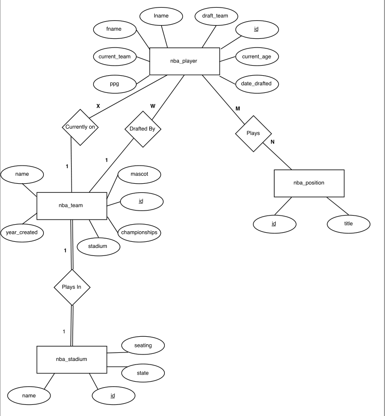
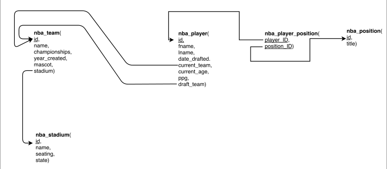

# NBA-Database
Database Project

This application uses an entity relationship model to create an NBA database. It utlizes MySQL (MariaDB), jQuery, JavaScript, HTML, CSS to create a user interface where they can view, add, delete, search/filter and edit entities. 

Further the backend is provided for by Node.js and the frontend uses an express and handlebars template system. 

This application is connected to - https://github.com/Ha-So/TRUE-NBA-web-app

# Diagrams

- ER Diagram

- Schema

# Screenshots

- Clean user interface allowing for smooth updates and additions to entities. 

- Dynamic search feature allowing filters and population of results via SQL

